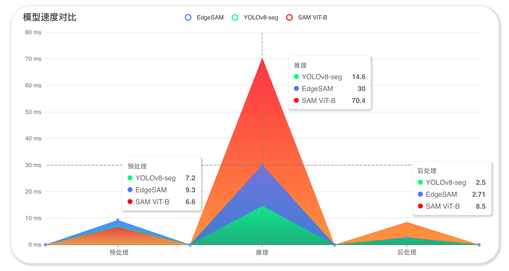
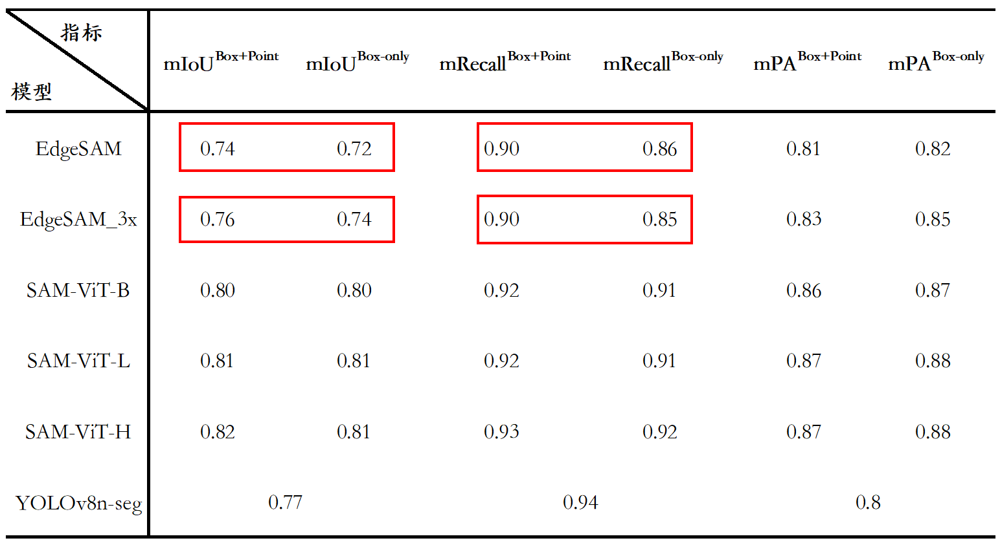
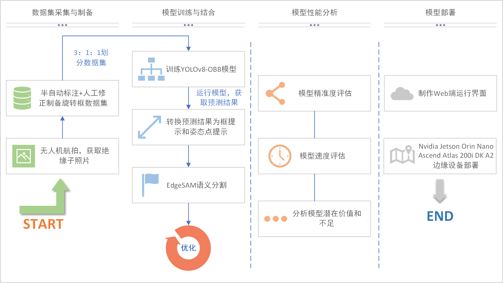
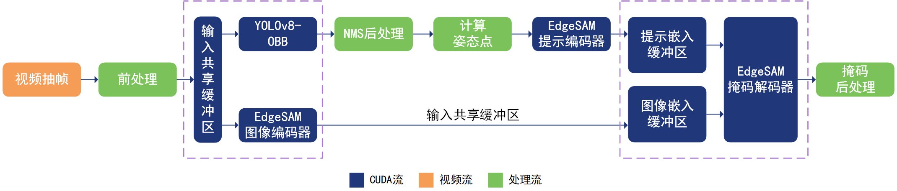
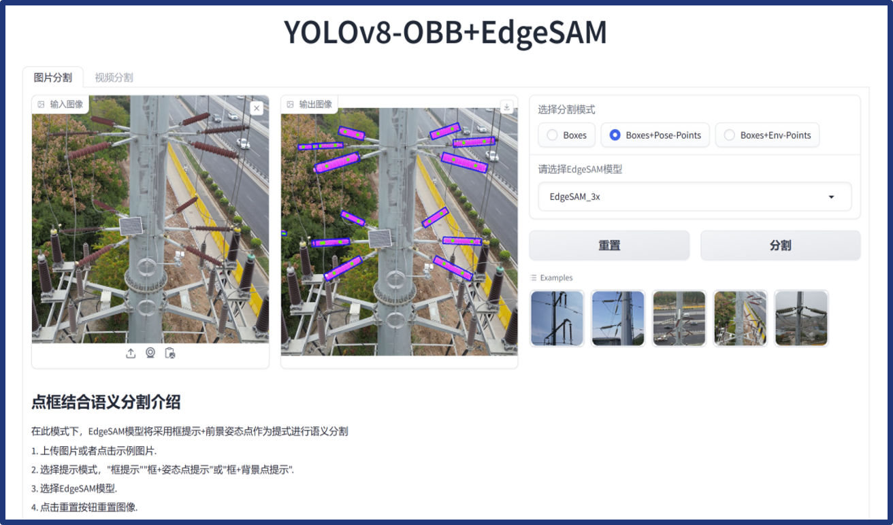
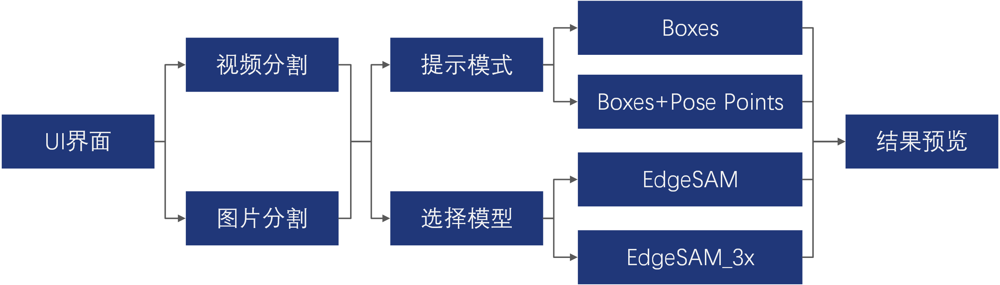

# 灿若星辰
## 一点点奇思妙想+一点点魔法

## 基于YOLOv8-OBB提示EdgeSAM的无人机航拍绝缘子语义分割系统

### 1.系统开发流程
|    图1：系统开发流程示意图 |
|:----------------------------------:|

### 2.模型性能展示
|    图2：模型速度展示 |
|:-------------------------------:|

|    图3：模型精度展示 |
|:-------------------------------:|

### 2.旋转框+姿态点提示的有效性展示
|    图4：左侧为旋转框+姿态点提示分割结果，右侧为框提示分割结果 |
|:----------------------------------------------------:|

### 4.模型推理优化架构
|    图5：模型推理优化架构示意图 |
|:------------------------------------:|

### 5.边缘端设备部署
|    图6：华为Ascend Atlas 200i DK A2部署 |    图7：Nvidia Jetson Orin Nano部署 |
|:----------------------------------------------------:|:--------------------------------------------------:|

### 6.UI界面设计及功能框架
|    图8：用户界面展示 |    图9：用户界面功能 |
|:-------------------------------:|:-------------------------------:|

